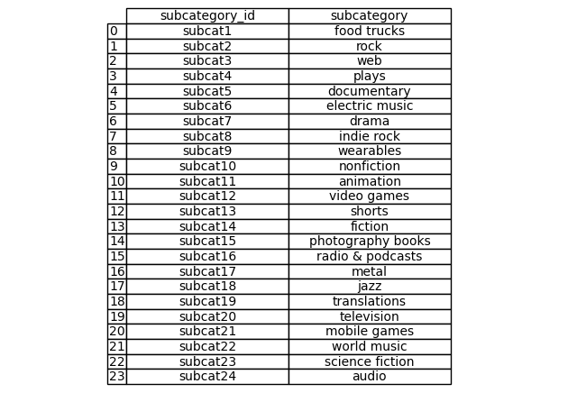
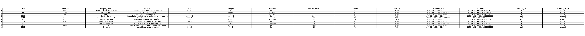
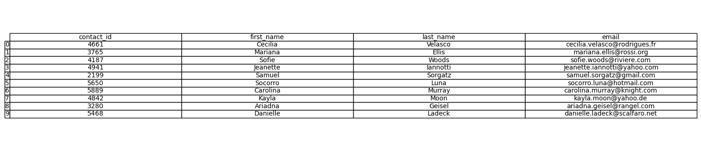

# Crowdfunding_ETL

## Overview of the Analysis

* This mini project seeks to build an ETL pipeline using Python, Pandas and Python dictionary method to extract and transform data. The transformed data is then converted into four csv files and uploaded into a Postgres database.  

## Results

### Data Extraction and Transformation

1. Extracted and transformed the data from the `crowdfunding.xlsx` file to create a category Dataframe with a "category_id" column and a "category" column. Additionally, created a subcategory DataFrame with a "subcategory_id" column and a "subcategory" column.

    a. The "category_id" column includes sequential entries from "cat1" to "catn", where n is the number of unique categories.The "category" column contains only the category titles.

    b. The "subcategory_id" column includes sequential entries from "subcat1" to "subcatn", where n is the number of unique subcategories. The "subcategory" column contains only the subcategory titles. 

2. Exported the category DataFrame as `category.csv`.

3. Exported the category DataFrame as `subcategory.csv`.

4. Extracted and transformed the data from the `crowdfunding.xlsx` file to create a campaign Dataframe with the following columns:

"cf_id"
"contact_id"
"company_name"
"blurb", renamed to "description"
"goal", converted to `float` data type
"pledged", converted to `float` data type
"outcome"
"backers_count"
"country"
"currency"
"launched_at", renamed to "launch_date" with the UTC times converted to the `datetime` format
"deadline", renamed to "end_date" with the UTC times converted to the `datetime` format
"category_id", with unique id numbers matching those in the "category_id" column of the category DataFrame
"subcategory_id", with unique id numbers matching those in the "subcategory_id" column of the subcategory DataFrame

5. Exported the campaign DataFrame as `campaign.csv`.

6. Used Python dictionary methods to import the `contacts.xlsx` file into a DataFrame, iterated through the DataFrame, converting each row into  dictionary, then iterated through each dictionary, extracting the dictionary values from the keys, and finally added the values for each row into a new list.

7. Converted the extracted data into a DataFrame where each "name" was split into first and last name and placed into new columns, respectively.

8. Cleaned and exported the DataFrame as `contacts.csv`.

9. Repeated steps 6-8 using regular expressions, exporting the DataFrame as `contacts2.csv`.

### Database Compilation

1. Inspected the `category.csv`, `subcategory.csv`, `campaign.csv`, and `contacts.csv` files then sketched an ERD of the tables using QuickDBD.

2. Created a table schema for each CSV file using the information from the ERD.

3. Saved the database schema as a Postgres file named `crowdfunding_db_schema.sql`.

4. Created a new Postgres database named `crowdfunding_db`, used the database schema to create tables to handle the foreign keys, then ran a SELECT statement to verify table creation.

5. Imported each CSV file into their corresponding SQL tables and ran a SELECT statement to verify each table had the correct data. 

