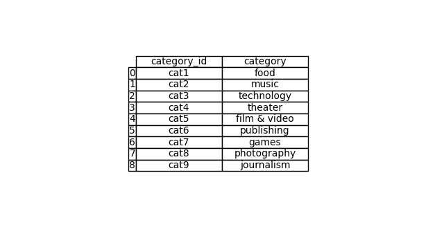

# Crowdfunding_ETL

## Overview of the Analysis

* This mini project seeks to build an ETL pipeline using Python, Pandas and Python dictionary method to extract and transform data. The transformed data is then converted into four csv files and uploaded into a Postgres database.  

## Results

### Data Extraction and Transformation

1. Extracted and transformed the data from the `crowdfunding.xlsx` file to create a category Dataframe with a "category_id" column and a "category" column.

    a. The "category_id" column includes sequential entries from "cat1" to "catn", where n is the number of unique categories.

    b. The "category" column contains only the category titles. 

2. Exported the category DataFrame as `category.csv`.

## Summary
